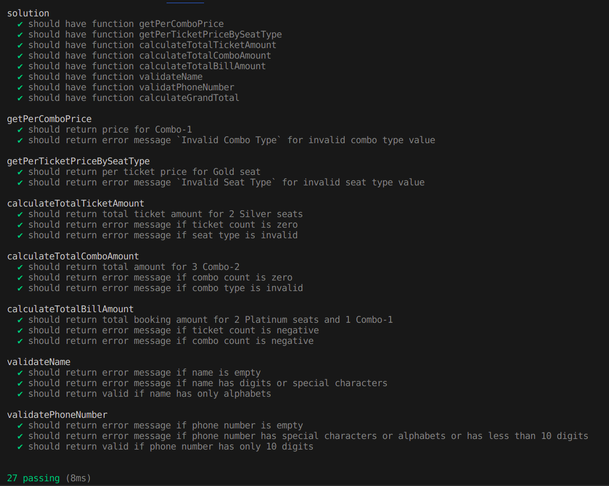

## Project - MovieZone Theaters Ticket Booking

### Context
For MovieZone theaters, Creative IT Solutions plans to create an app that would let patrons order food and tickets online.​

Depending on the quantity and kind of tickets purchased, the number of food combos requested, and other factors, the application should determine the total cost that the clients will be required to pay. Modular functions should be used to build the entire application to make testing and maintenance simpler.

Automated unit testing should be enabled to test the functions defined in the solution, ensuring that the code complies with the requirements and is error-free. This will make the program more robust.

For the functions to process only legitimate inputs and deliver error messages for erroneous inputs, there should be enough test cases added. It will also be required to refactor the code for these additional test cases, and provide error handling solutions that satisfy the test criteria.

### Problem Statement

- Create JavaScript functions for calculating total bill amount depending on the quantity and kind of tickets purchased, and the number of food combos requested.

- Write unit test cases to test the various JavaScript functions of the solution code.

- Refactor the code as necessary to make sure the test cases written to check functions for invalid inputs are passing.

#### Function Details

The table given below provides details of functions to be defined:

|Function Name|Valid Inputs|
|-------------|----------|
|getPerTicketPriceBySeatType|"Silver" / "Gold" / "Platinum"|
|getPerComboPrice|"Combo-1" / "Combo-2" / "Combo-3"|
|calculateTotalTicketAmount|Seat Type should be "Silver" / "Gold" / "Platinum", Ticket Count should be Greater Than Zero|
|calculateTotalComboAmount|Combo Type should be "Combo-1" / "Combo-2" / "Combo-3", Combo Count should be Greater Than Zero|
|calculateTotalBillAmount|Seat Type should be "Silver" / "Gold" / "Platinum", Ticket Count should be Greater Than Zero, Combo Type should be "Combo-1" / "Combo-2" / "Combo-3", Combo Count should be Greater Than Zero|
|validatName|Should not be empty and contain only alphabets|
|validatePhoneNumber|Should not be empty and contain only 10 digits|
|calculateGrandTotal|The function should iteratively prompt the user to input the name and the phone number value until the values are valid. If both are valid, only then the function should iteratively prompt the user to input the seat type, seat count, combo type, and combo count and calculate the total bill amount. The user should be prompted at each iteration to input `Y` to continue with the next iteration; otherwise, the user should input `N`. Once the user inputs 'N', the function should return the grand total of all the total bill amounts calculated.|

#### Price Details

- The table given below provides price details of different seat types at MovieZone theaters:​

|Seat Type|Per Ticket Price (INR)|
|-------------|---------
|Silver|250.00|
|Gold|350.00|
|Platinum|450.00|​

- The table given below provides price details of different combos offered by MovieZone theaters:

|Combo Type|Per Combo Price (INR)|
|-------------|---------
|Combo-1|150.00|
|Combo-2|275.00|
|Combo-3|475.00|​

#### Write Test Code to Evaluate Various Functions

- Write unit test cases to test the various JavaScript functions of the solution code.
- The test cases should test whether 
    - the desired functions exist
    - the functions return expected value for the valid inputs provided
    - the functions return expected error message for the invalid inputs provided    
- Refactor the solution code to ensure the created test cases are passing.​

**Preview of the test cases results**

